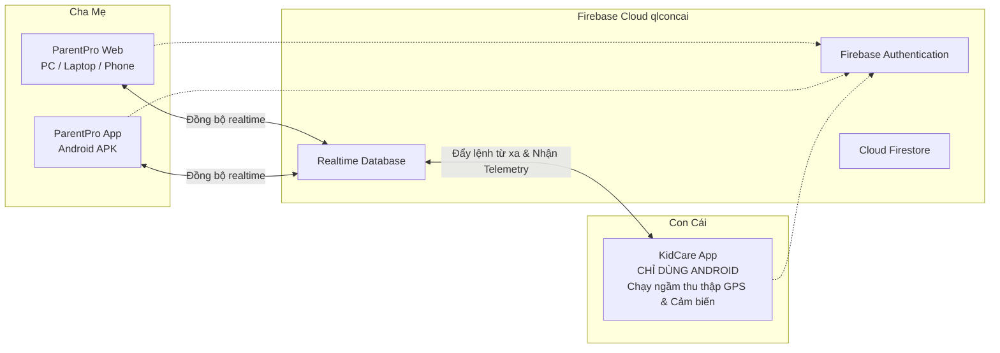

# Hướng Dẫn: Phiên Bản Web Quản Lý Con Cái Từ Xa Qua Internet (ParentPro Web)

Hệ thống quản lý con cái từ xa hỗ trợ mô hình đa nền tảng linh hoạt:
- **Cha Mẹ**: Sử dụng **Trình duyệt Web** trên bất kỳ thiết bị nào (Máy tính bàn, Laptop, Macbook, iPad, iPhone, điện thoại Android) hoặc **Ứng dụng Android** (`ParentPro-AppChaMe.apk`).
- **Con Cái**: **CHỈ sử dụng ứng dụng Android** (`KidCare-AppConCai.apk`) trên điện thoại của con.
- **Hạ Tầng Điện Toán Đám Mây**: Cả Web và App đều kết nối thời gian thực qua Firebase Cloud (`qlconcai`) với độ trễ dưới 0.5 giây.

---

## 1. Các Cách Đưa Web Lên Internet & Truy Cập

### 🌐 Cách 1: Triển Khai Miễn Phí Lên Firebase Hosting (Khuyến Nghị)

Dự án đã được cấu hình sẵn tệp `firebase.json` và `.firebaserc` liên kết trực tiếp với dự án Firebase `qlconcai` của bạn.

1. **Đăng nhập Firebase CLI** (chỉ cần làm lần đầu tiên):
   ```bash
   npx firebase login
   ```
2. **Biên dịch và Deploy chỉ bằng 1 câu lệnh**:
   ```bash
   npm run deploy:web
   ```
3. **Đường dẫn truy cập toàn cầu qua Internet**:
   - `https://qlconcai.web.app`
   - `https://qlconcai.firebaseapp.com`

---

### ⚡ Cách 2: Triển Khai 1-Click Lên Vercel Hoặc Netlify

Dự án đã tích hợp sẵn `vercel.json` và `netlify.toml` với cơ chế điều hướng Single Page App (SPA):

- **Triển khai lên Vercel**:
  1. Cài đặt hoặc chạy Vercel CLI:
     ```bash
     npx vercel
     ```
  2. Hoặc đẩy mã nguồn lên GitHub và kết nối với tài khoản [vercel.com](https://vercel.com) (tự động nhận diện lệnh `npm run build` và thư mục `dist`).
  3. Bạn có thể gắn tên miền riêng miễn phí (ví dụ: `https://quanlycon.yourdomain.com`).

- **Triển khai lên Netlify**:
  1. Kéo thả thư mục `dist` sau khi chạy `npm run build:web` vào trang [app.netlify.com/drop](https://app.netlify.com/drop).
  2. Trang web sẽ hoạt động ngay lập tức với giao thức bảo mật HTTPS.

---

### 🏠 Cách 3: Truy Cập Trực Tiếp Trong Mạng Nội Bộ (LAN / WiFi)

Nếu bạn muốn kiểm tra nhanh trên các thiết bị trong cùng mạng WiFi gia đình:

1. Chạy lệnh:
   ```bash
   npm run preview:web
   ```
2. Mở trình duyệt trên máy tính khác hoặc điện thoại và truy cập địa chỉ IP máy tính:
   ```
   http://192.168.x.x:3000
   ```
   *(Thay `192.168.x.x` bằng địa chỉ IPv4 máy tính của bạn, xem bằng lệnh `ipconfig`)*.

---

### 🌍 Cách 4: Tạo Link Truy Cập Internet Tức Thì Bằng Cloudflare Tunnel (Không Cần Deploy)

Nếu bạn đang chạy server trên máy tính và muốn gửi ngay một link HTTPS công khai cho người thân ở xa truy cập:

1. Mở cửa sổ dòng lệnh (PowerShell) và chạy:
   ```bash
   npx cloudflared tunnel --url http://localhost:3000
   ```
2. Cloudflare sẽ cấp ngay cho bạn một đường link HTTPS an toàn dạng:
   ```
   https://abc-xyz.trycloudflare.com
   ```
3. Bạn có thể mở link này trên bất kỳ điện thoại hay máy tính nào trên toàn thế giới để vào giao diện ParentPro Web.

---

## 2. Các Tính Năng Nổi Bật Trên Phiên Bản Web (ParentPro Web)

1. **Giao Diện Máy Tính / Laptop (Desktop View)**:
   - **Thanh Sidebar Bên Trái**: Danh mục quản trị chuyên nghiệp (Tổng quan Dashboard, Định vị GPS thời gian thực, Giới hạn thời gian dùng & Ứng dụng, Báo cáo học tập & sức khỏe, Thành viên & Thiết bị Android của con, Trung tâm điều khiển từ xa, Cảnh báo SOS, Cài đặt hệ thống).
   - **Bộ Chọn Con Cái (Child Switcher)**: Dễ dàng chuyển đổi giữa các con, xem ngay % pin thực tế và tình trạng thiết bị.
   - **Thanh Tiêu Đề Thời Gian Thực**: Hiển thị trạng thái kết nối Cloud Firebase (`🟢 Cloud Realtime Online`) cùng 2 nút hành động khẩn cấp nhanh:
     - 🔒 **Khóa Máy**: Khóa tức thời điện thoại con.
     - 🔔 **Tìm Máy**: Rung chuông tìm điện thoại con với âm lượng lớn.
2. **Giao Diện Di Động Trên Trình Duyệt Điện Thoại (Mobile Web View)**:
   - Khi mở link Web trên iPhone, iPad hoặc trình duyệt điện thoại, giao diện tự động co giãn về chuẩn mobile với thanh điều hướng đáy mượt mà y hệt như ứng dụng native.
3. **Đăng Nhập Đa Dạng**:
   - Hỗ trợ đăng nhập nhanh bằng **Tài khoản Google (Google Sign-In popup)**.
   - Hỗ trợ đăng ký và đăng nhập bằng **Email & Mật khẩu**.

---

## 3. Quy Trình Phối Hợp Giữa Web Cha Mẹ Và App Con Cái



1. **Trên máy con cái**:
   - Cài đặt gói `KidCare-AppConCai.apk` lên điện thoại Android của con.
   - Đăng nhập tài khoản con cái và cấp các quyền cơ bản (Vị trí nền, Hiển thị trên ứng dụng khác, Dịch vụ chạy ngầm).
2. **Trên máy cha mẹ (Web hoặc App)**:
   - Mở link web hoặc ứng dụng Cha Mẹ, đăng nhập cùng tài khoản quản trị gia đình.
   - Mọi tọa độ GPS, mức pin, thời gian con dùng app sẽ xuất hiện ngay lập tức trên bản đồ và bảng thống kê.
   - Bất kỳ thao tác nào phụ huynh bấm trên Web (như tắt GPS để tiết kiệm pin, khóa máy, rung chuông, đổi giờ học) sẽ truyền ngay đến điện thoại Android của con trong vòng 0.5 giây!
